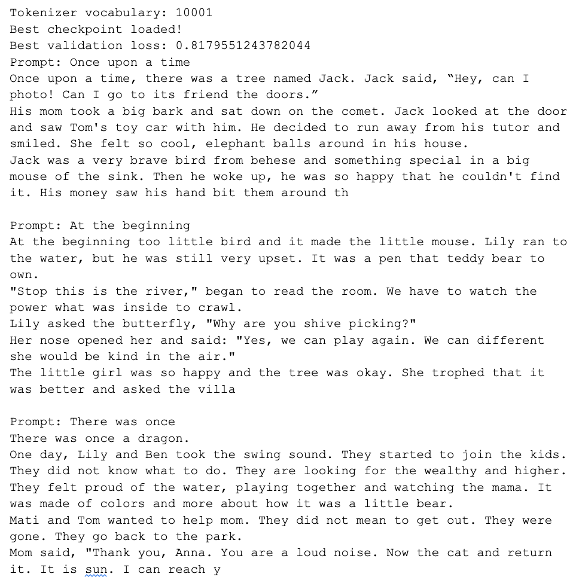

# Transformer-Language-Model
Implementation of pre-norm Transformer-LM with Rope embeddings. 

## Output

<p align="center">
  
</p>

## Dataset
The dataset used is TinyStories

## Tokenizer
BPE based tokenizer trained on TinyStories

## Parameter initialization
1. Linear weights: N(mean= 0, var = 2 / (d_in + d_out)) truncated at [−3 std, 3 std].
2. Embedding: N (mean = 0, var = 1) truncated at [−3, 3]
3. RMSNorm: 𝟙

## Building blocks
The building blocks implementation can be found inside helpers/building_blocks.py
```text
1. Embedding
2. LinearProjection
3. RMSNorm
4. FPP (with Swiglu)
5. Position Embedding (ROPE)
6. Softmax
7. Scaled-dot-product
8. Multi-head Attention
9. Transformer block
```

## Model
The model size for training on the Tiny stories is
```text
context_length = 512
d_model = 384
num_heads = 8
num_layers = 6
d_ff = 1024
theta = 10000.0
```

## Optimizer and LR-scheduler
1. Optimizer: AdamW
2. Learning-rate scheduler: cosine annealing schedule


